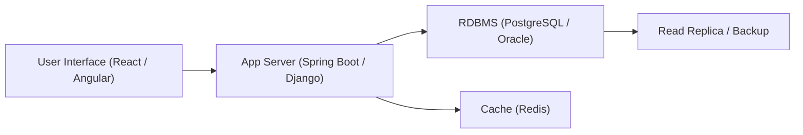

```mermaid
graph LR
  UI["User Interface (React / Angular)"] --> APP["App Server (Spring Boot / Django)"]
  APP --> DB["RDBMS (PostgreSQL / Oracle)"]
  APP --> CACHE["Cache (Redis)"]
  DB --> REPL["Read Replica / Backup"]


```
