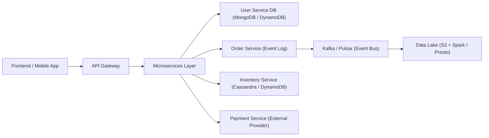
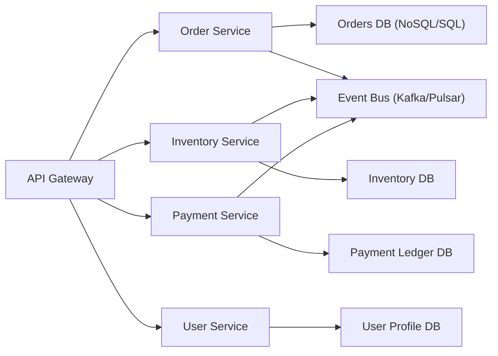

```mermaid
graph LR
  UI["Frontend / Mobile App"] --> GW["API Gateway"]
  GW --> MS["Microservices Layer"]
  MS --> US["User Service DB (MongoDB / DynamoDB)"]
  MS --> OS["Order Service (Event Log)"]
  MS --> IS["Inventory Service (Cassandra / DynamoDB)"]
  MS --> PS["Payment Service (External Provider)"]
  OS --> KAFKA["Kafka / Pulsar (Event Bus)"]
  KAFKA --> DL["Data Lake (S3 + Spark / Presto)"]
```

```mermaid
graph LR
  API["API Gateway"] --> ORD["Order Service"]
  API --> INV["Inventory Service"]
  API --> PAY["Payment Service"]
  API --> USR["User Service"]

  ORD --> DB1["Orders DB (NoSQL/SQL)"]
  INV --> DB2["Inventory DB"]
  PAY --> DB3["Payment Ledger DB"]
  USR --> DB4["User Profile DB"]

  ORD --> BUS["Event Bus (Kafka/Pulsar)"]
  INV --> BUS
  PAY --> BUS
```
