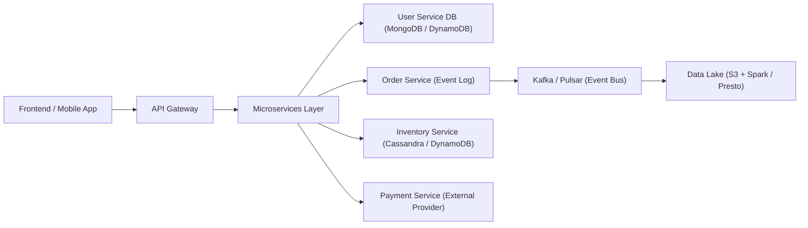
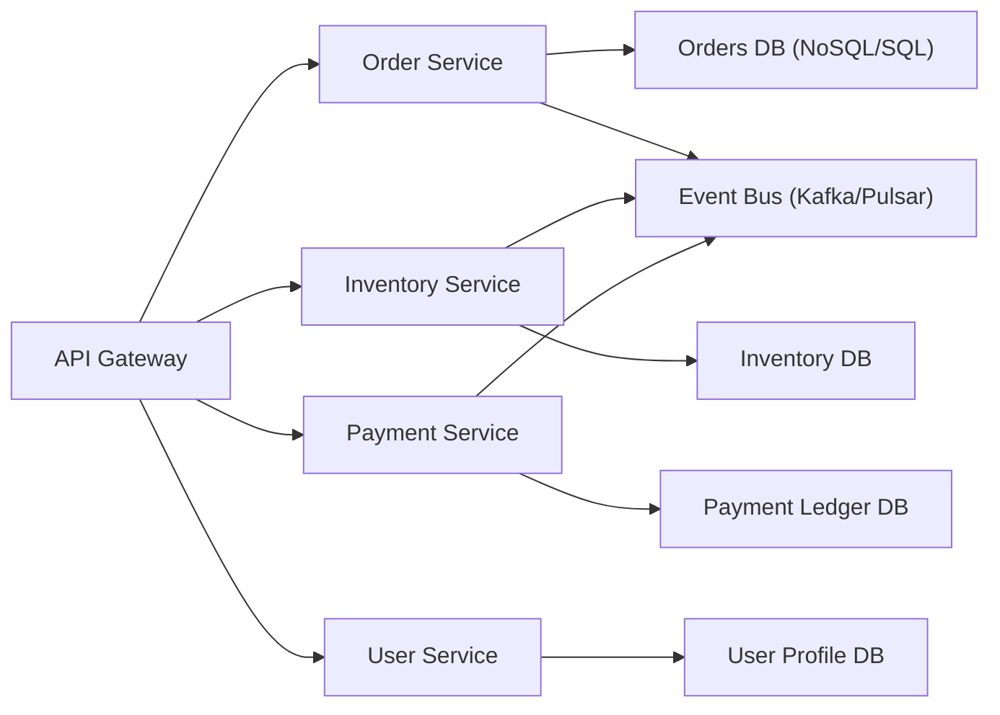
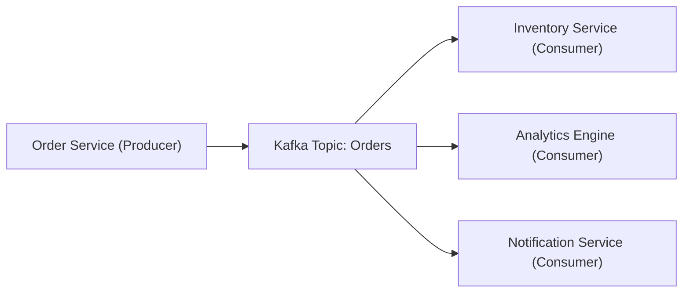

```mermaid
graph LR
  %% Entry
  C["Client / Frontend"] --> GW["API Gateway (Auth, Throttle, Circuit Breaker)"]

  %% CQRS split
  GW -->|Commands (writes)| CMD["Command API (Write Path)"]
  GW -->|Queries (reads)| QRY["Query API (Read Path)"]

  %% Write path: Event-first
  CMD --> VAL["Stateless Validation + Idempotency Check"]
  VAL --> BUS["Event Stream (Kafka/Pulsar)"]

  %% Microservices consume events (loose coupling)
  subgraph MS["Microservices (Basically Available, Horizontally Scalable)"]
    direction LR
    ORD["Order Service"]:::svc
    PAY["Payment Service"]:::svc
    INV["Inventory Service"]:::svc
    SHP["Shipping Service"]:::svc
    NOTI["Notification Service"]:::svc
  end

  BUS --> ORD
  BUS --> PAY
  BUS --> INV
  BUS --> SHP
  BUS --> NOTI

  %% Each service owns its storage (polyglot persistence)
  subgraph DS["Per-Service Data Stores (Soft State inside; Own the truth for their domain)"]
    direction LR
    DORD["Order DB (Document/Column)"]:::db
    DPAY["Payment Ledger (SQL/Append-only)"]:::db
    DINV["Inventory DB (KV/Column)"]:::db
    DSHP["Shipment DB (Document)"]:::db
    DCFG["Config/Feature Flags (KV)"]:::db
  end

  ORD --> DORD
  PAY --> DPAY
  INV --> DINV
  SHP --> DSHP

  %% Materialized views / read models
  subgraph READS["Read Models (Materialized Views = Soft State)"]
    direction LR
    MV1["Product Catalog View (Search/ES)"]:::read
    MV2["Order Status View (Redis/Cache)"]:::read
    MV3["Customer 360 View (Denormalized)"]:::read
  end

  %% Async projection from events to read models
  BUS -.->|Project/Transform| MV1
  BUS -.->|Project/Transform| MV2
  BUS -.->|Project/Transform| MV3

  %% Query path uses views/caches (eventually consistent)
  QRY --> CACHE["Cache (Redis)"]:::read
  CACHE --> RESP["Response (Low Latency, Eventually Consistent)"]
  QRY --> MV1
  QRY --> MV2
  QRY --> MV3

  %% Lakehouse / analytics (schema-on-read)
  subgraph LAKE["Analytics & Lakehouse (Schema-on-Read)"]
    direction LR
    OBJ["Object Store (S3/OCI/Snow)"]:::lake
    META["Table Formats (Delta/Iceberg/Hudi)"]:::lake
    ENG["Engines (Spark/Presto/Trino)"]:::lake
    FS["Feature Store (ML/Online-Offline)"]:::lake
  end
  BUS -->|Ingest/ELT| OBJ
  OBJ --> META
  META --> ENG
  ENG --> FS
  FS -.-> MV3

  %% Cross-cutting: resiliency and ops
  subgraph X["Resiliency & Ops"]
    RT["Retry/Backoff, Dead-Letter Topics"]:::ops
    CB["Circuit Breakers, Timeouts, Bulkheads"]:::ops
    OBS["Observability (Logs, Metrics, Traces, SLOs)"]:::ops
    SEC["Zero-Trust, JWT, OPA/ABAC"]:::ops
  end
  CMD -.-> RT
  GW -.-> CB
  MS -.-> OBS
  DS -.-> OBS
  BUS -.-> OBS
  QRY -.-> OBS

  %% Notes on BASE properties
  note right of READS
    Soft State: derived views & caches
    updated asynchronously from events
    (may lag source of truth).
  end

  note right of RESP
    Eventually Consistent:
    reads may briefly see stale data
    until projections catch up.
  end

  classDef svc fill:#eef,stroke:#88a,stroke-width:1px
  classDef db fill:#efe,stroke:#6a6,stroke-width:1px
  classDef read fill:#fee,stroke:#a66,stroke-width:1px
  classDef lake fill:#f0f8ff,stroke:#79a,stroke-width:1px
  classDef ops fill:#f7f7f7,stroke:#aaa,stroke-width:1px
```





