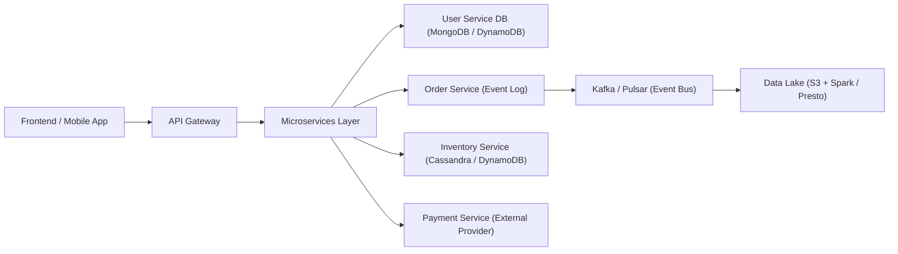

```mermaid
graph LR
  UI["Frontend / Mobile App"] --> GW["API Gateway"]
  GW --> MS["Microservices Layer"]
  MS --> US["User Service DB (MongoDB / DynamoDB)"]
  MS --> OS["Order Service (Event Log)"]
  MS --> IS["Inventory Service (Cassandra / DynamoDB)"]
  MS --> PS["Payment Service (External Provider)"]
  OS --> KAFKA["Kafka / Pulsar (Event Bus)"]
  KAFKA --> DL["Data Lake (S3 + Spark / Presto)"]
```
