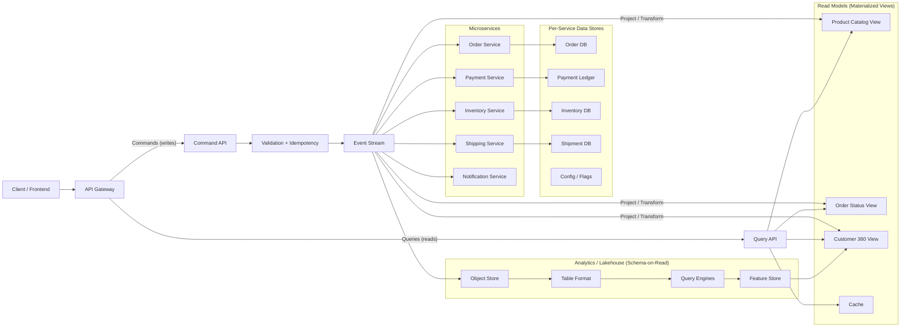
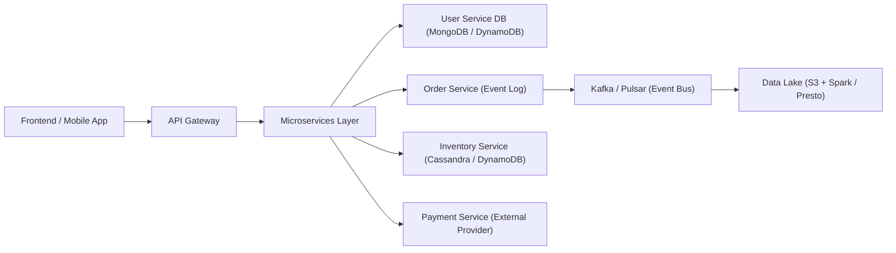
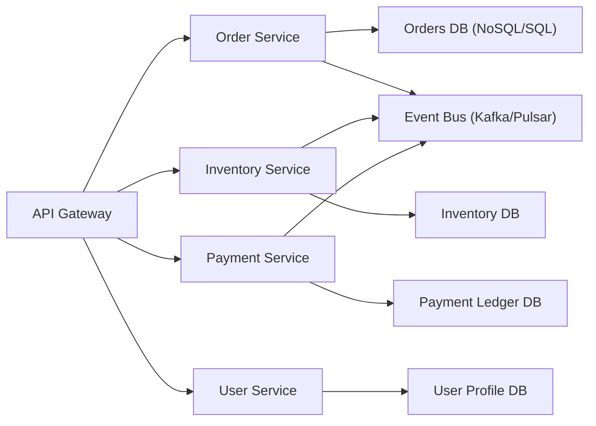
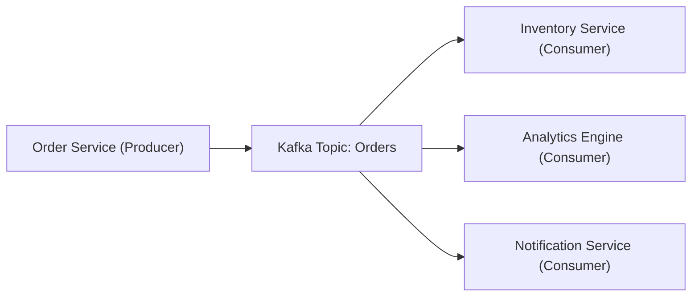

```mermaid
graph LR
  C["Client / Frontend"] --> GW["API Gateway"]

  GW -- "Commands (writes)" --> CMD["Command API"]
  GW -- "Queries (reads)" --> QRY["Query API"]

  CMD --> VAL["Validation + Idempotency"]
  VAL --> BUS["Event Stream"]

  subgraph MS["Microservices"]
    ORD["Order Service"]
    PAY["Payment Service"]
    INV["Inventory Service"]
    SHP["Shipping Service"]
    NOTI["Notification Service"]
  end

  BUS --> ORD
  BUS --> PAY
  BUS --> INV
  BUS --> SHP
  BUS --> NOTI

  subgraph DS["Per-Service Data Stores"]
    DORD["Order DB"]
    DPAY["Payment Ledger"]
    DINV["Inventory DB"]
    DSHP["Shipment DB"]
    DCFG["Config / Flags"]
  end

  ORD --> DORD
  PAY --> DPAY
  INV --> DINV
  SHP --> DSHP

  subgraph READS["Read Models (Materialized Views)"]
    MV1["Product Catalog View"]
    MV2["Order Status View"]
    MV3["Customer 360 View"]
    CACHE["Cache"]
  end

  BUS -- "Project / Transform" --> MV1
  BUS -- "Project / Transform" --> MV2
  BUS -- "Project / Transform" --> MV3

  QRY --> CACHE
  QRY --> MV1
  QRY --> MV2
  QRY --> MV3

  subgraph LAKE["Analytics / Lakehouse (Schema-on-Read)"]
    OBJ["Object Store"]
    META["Table Format"]
    ENG["Query Engines"]
    FS["Feature Store"]
  end

  BUS --> OBJ
  OBJ --> META
  META --> ENG
  ENG --> FS
  FS --> MV3

```

```mermaid
graph LR
  UI["Frontend / Mobile App"] --> GW["API Gateway"]
  GW --> MS["Microservices Layer"]
  MS --> US["User Service DB (MongoDB / DynamoDB)"]
  MS --> OS["Order Service (Event Log)"]
  MS --> IS["Inventory Service (Cassandra / DynamoDB)"]
  MS --> PS["Payment Service (External Provider)"]
  OS --> KAFKA["Kafka / Pulsar (Event Bus)"]
  KAFKA --> DL["Data Lake (S3 + Spark / Presto)"]
```

```mermaid
graph LR
  API["API Gateway"] --> ORD["Order Service"]
  API --> INV["Inventory Service"]
  API --> PAY["Payment Service"]
  API --> USR["User Service"]

  ORD --> DB1["Orders DB (NoSQL/SQL)"]
  INV --> DB2["Inventory DB"]
  PAY --> DB3["Payment Ledger DB"]
  USR --> DB4["User Profile DB"]

  ORD --> BUS["Event Bus (Kafka/Pulsar)"]
  INV --> BUS
  PAY --> BUS
```

```mermaid
graph LR
  P1["Order Service (Producer)"] --> T["Kafka Topic: Orders"]
  T --> C1["Inventory Service (Consumer)"]
  T --> C2["Analytics Engine (Consumer)"]
  T --> C3["Notification Service (Consumer)"]
```
