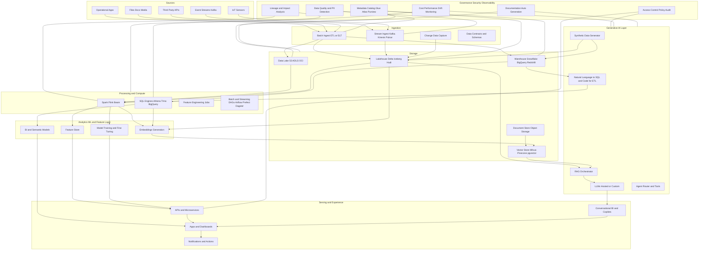
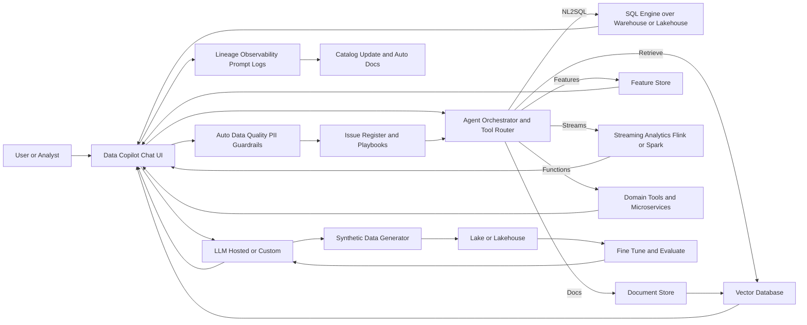
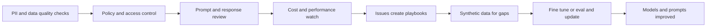

```mermaid
graph TD
  %% ===== Sources =====
  subgraph L0[Sources]
    S1[Operational Apps]
    S2[Event Streams Kafka]
    S3[IoT Sensors]
    S4[Files Docs Media]
    S5[Third Party APIs]
  end

  %% ===== Ingestion =====
  subgraph L1[Ingestion]
    I1[Batch Ingest ETL or ELT]
    I2[Stream Ingest Kafka Kinesis Pulsar]
    I3[Change Data Capture]
    I4[Data Contracts and Schemas]
  end

  %% ===== Storage =====
  subgraph L2[Storage]
    ST1[Data Lake S3 ADLS OCI]
    ST2[Lakehouse Delta Iceberg Hudi]
    ST3[Warehouse Snowflake BigQuery Redshift]
    ST4[Vector Store Milvus Pinecone pgvector]
    ST5[Document Store Object Storage]
  end

  %% ===== Processing =====
  subgraph L3[Processing and Compute]
    P1[Spark Flink Beam]
    P2[SQL Engines Athena Trino BigQuery]
    P3[Feature Engineering Jobs]
    P4[Batch and Streaming DAGs Airflow Prefect Dagster]
  end

  %% ===== Analytics and ML =====
  subgraph L4[Analytics ML and Feature Layer]
    A1[BI and Semantic Models]
    A2[Feature Store]
    A3[Model Training and Fine Tuning]
    A4[Embeddings Generation]
  end

  %% ===== Generative AI =====
  subgraph L5[Generative AI Layer]
    G1[LLMs Hosted or Custom]
    G2[RAG Orchestrator]
    G3[Agent Router and Tools]
    G4[Synthetic Data Generator]
    G5[Natural Language to SQL and Code for ETL]
  end

  %% ===== Serving =====
  subgraph L6[Serving and Experience]
    SV1[APIs and Microservices]
    SV2[Conversational BI and Copilots]
    SV3[Apps and Dashboards]
    SV4[Notifications and Actions]
  end

  %% ===== Governance =====
  subgraph G0[Governance Security Observability]
    C1[Metadata Catalog Glue Atlas Purview]
    C2[Lineage and Impact Analysis]
    C3[Data Quality and PII Detection]
    C4[Access Control Policy Audit]
    C5[Cost Performance Drift Monitoring]
    C6[Documentation Auto Generation]
  end

  %% Flows
  S1 --> I1
  S2 --> I2
  S3 --> I2
  S4 --> I1
  S5 --> I1

  I1 --> ST1
  I1 --> ST2
  I1 --> ST3
  I2 --> ST2
  I3 --> ST2

  ST1 --> P1
  ST2 --> P1
  ST3 --> P2

  P1 --> A2
  P1 --> A3
  P1 --> A4
  P2 --> A1
  P2 --> A4

  ST5 --> ST4
  ST2 --> A4
  A4 --> ST4

  ST3 --> G5
  ST2 --> G2
  ST4 --> G2
  G2 --> G1
  G1 --> SV2
  G5 --> P1

  G4 --> ST2
  G4 --> ST3

  A1 --> SV3
  A2 --> SV1
  A3 --> SV1
  SV1 --> SV3
  SV2 --> SV3
  SV3 --> SV4

  C1 --- ST1
  C1 --- ST2
  C1 --- ST3
  C2 --- P1
  C2 --- P2
  C3 --- I1
  C3 --- I2
  C4 --- SV1
  C4 --- L5
  C5 --- L3
  C5 --- L5
  C6 --- L2
  C6 --- L5

```

```mermaid
graph LR
  U[User or Analyst] --> CP[Data Copilot Chat UI]
  CP --> ORCH[Agent Orchestrator and Tool Router]

  ORCH -->|NL2SQL| SQL[SQL Engine over Warehouse or Lakehouse]
  ORCH -->|Retrieve| VEC[Vector Database]
  ORCH -->|Docs| DOC[Document Store]
  ORCH -->|Features| FST[Feature Store]
  ORCH -->|Streams| STR[Streaming Analytics Flink or Spark]
  ORCH -->|Functions| FX[Domain Tools and Microservices]

  DOC --> VEC
  SQL --> CP
  VEC --> CP
  STR --> CP
  FST --> CP
  FX --> CP

  CP --> LLM[LLM Hosted or Custom]
  LLM --> CP

  CP --> QLT[Auto Data Quality PII Guardrails]
  CP --> LOG[Lineage Observability Prompt Logs]
  QLT --> IMP[Issue Register and Playbooks]
  LOG --> CATA[Catalog Update and Auto Docs]
  IMP --> ORCH

  LLM --> SYN[Synthetic Data Generator]
  SYN --> LAKE[Lake or Lakehouse]
  LAKE --> RETRAIN[Fine Tune and Evaluate]
  RETRAIN --> LLM
```
From raw data to decisions

```mermaid
graph LR
  A1[Scene 1 Sources arrive] --> A2[Scene 2 Ingest batch or streams]
  A2 --> A3[Scene 3 Land into lake or lakehouse]
  A3 --> A4[Scene 4 Transform and model with spark or sql]
  A4 --> A5[Scene 5 Build features and embeddings]
  A5 --> A6[Scene 6 GenAI retrieves with rag]
  A6 --> A7[Scene 7 LLM reasons and drafts]
  A7 --> A8[Scene 8 Serve via api copilot or app]
  A8 --> A9[Scene 9 Human reviews and approves]
  A9 --> A10[Scene 10 Action taken notify or automate]

```
RAG query to answer to action

```mermaid
graph LR
  B1[User asks a question] --> B2[Intent parsed by copilot]
  B2 --> B3[Router chooses tools]
  B3 --> B4[Retrieve docs from vector store]
  B4 --> B5[Fetch facts with sql on warehouse]
  B5 --> B6[LLM composes answer with citations]
  B6 --> B7[Show result and sql trace]
  B7 --> B8[Offer actions create ticket send email call api]
  B8 --> B9[Log lineage prompts and metrics]
```
Guardrails and Improvement loop

```mermaid
graph LR
  C1[PII and data quality checks] --> C2[Policy and access control]
  C2 --> C3[Prompt and response review]
  C3 --> C4[Cost and performance watch]
  C4 --> C5[Issues create playbooks]
  C5 --> C6[Synthetic data for gaps]
  C6 --> C7[Fine tune or eval and update]
  C7 --> C8[Models and prompts improved]
```
