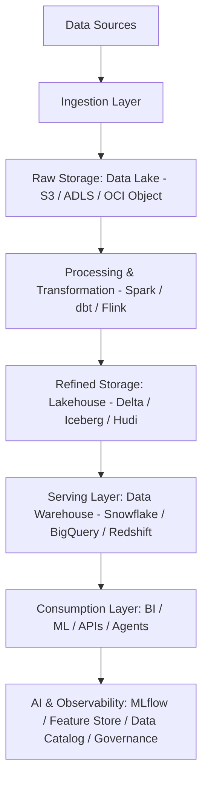
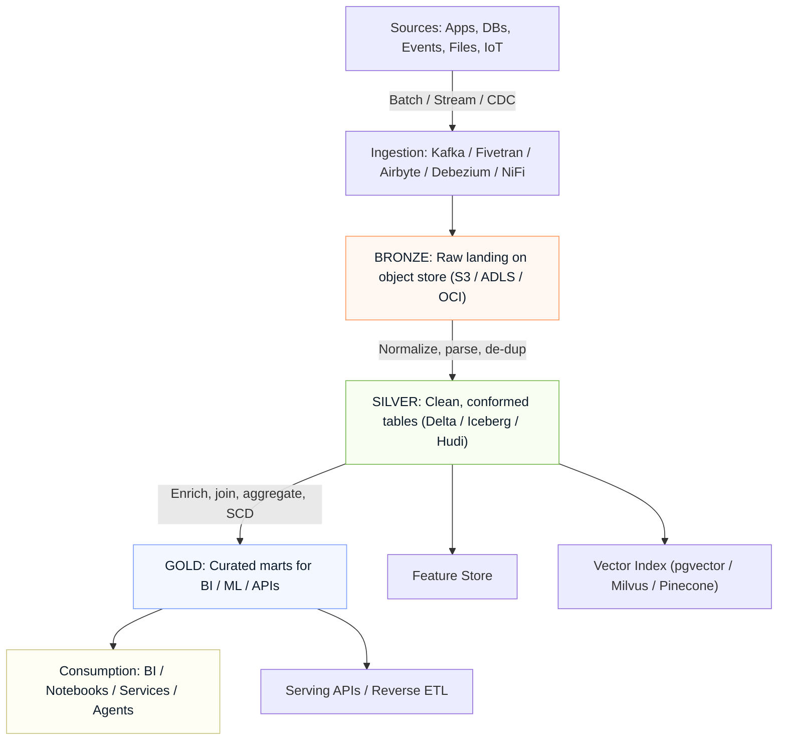

```mermaid
graph TD
  A[Data Sources] --> B[Ingestion Layer]
  B --> C["Raw Storage: Data Lake - S3 / ADLS / OCI Object"]
  C --> D["Processing & Transformation - Spark / dbt / Flink"]
  D --> E["Refined Storage: Lakehouse - Delta / Iceberg / Hudi"]
  E --> F["Serving Layer: Data Warehouse - Snowflake / BigQuery / Redshift"]
  F --> G["Consumption Layer: BI / ML / APIs / Agents"]
  G --> H["AI & Observability: MLflow / Feature Store / Data Catalog / Governance"]
```
MEDALLION ARCHITECTURE

```mermaid
graph TD
  S["Sources: Apps, DBs, Events, Files, IoT"] -->|Batch / Stream / CDC| ING["Ingestion: Kafka / Fivetran / Airbyte / Debezium / NiFi"]
  ING --> BZ["BRONZE: Raw landing on object store (S3 / ADLS / OCI)"]
  BZ -->|Normalize, parse, de-dup| SV["SILVER: Clean, conformed tables (Delta / Iceberg / Hudi)"]
  SV -->|Enrich, join, aggregate, SCD| GD["GOLD: Curated marts for BI / ML / APIs"]
  GD --> CON["Consumption: BI / Notebooks / Services / Agents"]
  
  %% Sidecars
  SV --> FS["Feature Store"]
  SV --> VX["Vector Index (pgvector / Milvus / Pinecone)"]
  GD --> API["Serving APIs / Reverse ETL"]
  
  %% Controls
  classDef g fill:#f3f7ff,stroke:#7da0fa,stroke-width:1px,color:#0d1b2a;
  classDef s fill:#f8fff2,stroke:#79b851,stroke-width:1px,color:#0d1b2a;
  classDef b fill:#fff8f2,stroke:#ff995e,stroke-width:1px,color:#0d1b2a;
  classDef c fill:#fffef4,stroke:#c7c480,stroke-width:1px,color:#0d1b2a;
  class BZ b; class SV s; class GD g; class CON c;
```
