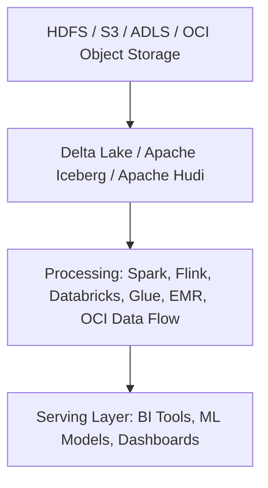

```mermaid
graph LR
  A[Producers<br>(Apps, APIs, IoT, DB Streams)] -->|Publish Events| B[(Kafka Topics)]
  B -->|Stream Processing| C[Spark Structured Streaming / Flink / kSQL / Kafka Streams]
  C -->|Processed Data| D[(Sink: S3 / Delta Lake / Data Warehouse)]
  C -->|Enriched Stream| E[Serving APIs / Dashboards / Alerts]
```
