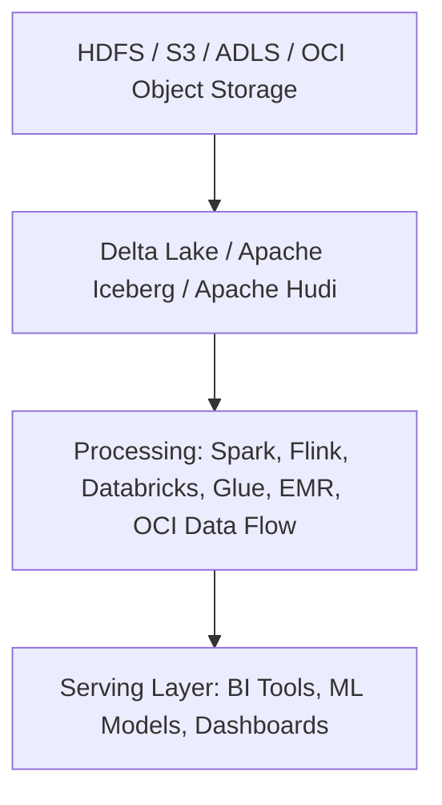

```mermaid
graph TD
    A[HDFS / S3 / ADLS / OCI Object Storage] --> B[Delta Lake / Apache Iceberg / Apache Hudi]
    B --> C[Processing: Spark, Flink, Databricks, Glue, EMR, OCI Data Flow]
    C --> D[Serving Layer: BI Tools, ML Models, Dashboards]
```
