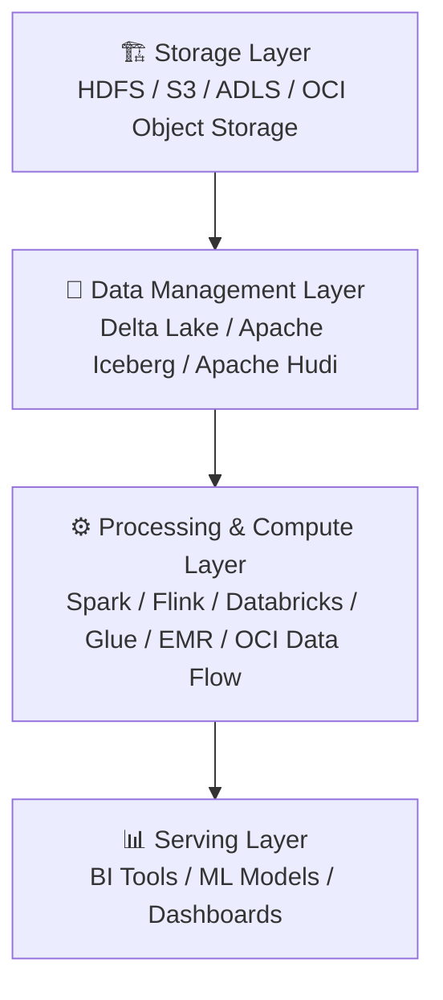
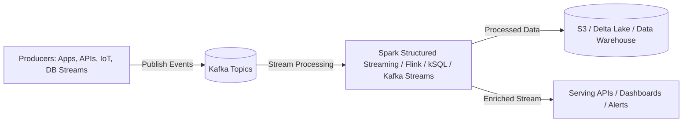
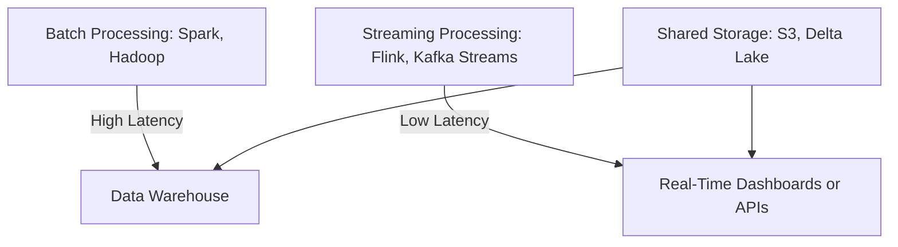

```mermaid
%% -------------------------------------------------------------------
%% DATA STORAGE + PROCESSING LAYERS
%% -------------------------------------------------------------------
graph TD
    %% Raw storage layer
    A[🏗️ Storage Layer<br/>HDFS / S3 / ADLS / OCI Object Storage]
    %% Unified transactional layer
    A --> B[🧩 Data Management Layer<br/>Delta Lake / Apache Iceberg / Apache Hudi]
    %% Processing engines
    B --> C[⚙️ Processing & Compute Layer<br/>Spark / Flink / Databricks / Glue / EMR / OCI Data Flow]
    %% Serving and analytics
    C --> D[📊 Serving Layer<br/>BI Tools / ML Models / Dashboards]

    %% Comments
    %% A = where raw data lands (cheap, scalable storage)
    %% B = adds ACID, schema, and versioning to make lakes reliable
    %% C = transforms, aggregates, and enriches data
    %% D = delivers insights to business or ML systems

```

```mermaid
graph LR
    A[Producers: Apps, APIs, IoT, DB Streams] -->|Publish Events| B[(Kafka Topics)]
    B -->|Stream Processing| C[Spark Structured Streaming / Flink / kSQL / Kafka Streams]
    C -->|Processed Data| D[(S3 / Delta Lake / Data Warehouse)]
    C -->|Enriched Stream| E[Serving APIs / Dashboards / Alerts]

```

```mermaid
graph TD
    A[Batch Processing: Spark, Hadoop] -->|High Latency| B[Data Warehouse]
    C[Streaming Processing: Flink, Kafka Streams] -->|Low Latency| D[Real-Time Dashboards or APIs]
    E[Shared Storage: S3, Delta Lake] --> B
    E --> D
```
