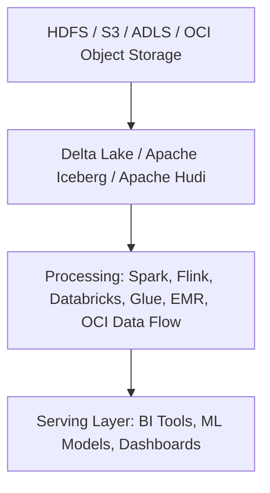
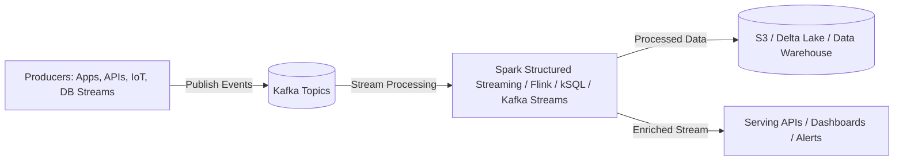
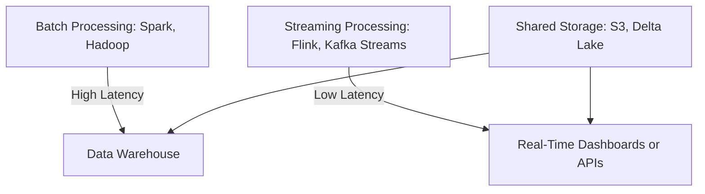

```mermaid
graph TD
    A[HDFS / S3 / ADLS / OCI Object Storage] --> B[Delta Lake / Apache Iceberg / Apache Hudi]
    B --> C[Processing: Spark, Flink, Databricks, Glue, EMR, OCI Data Flow]
    C --> D[Serving Layer: BI Tools, ML Models, Dashboards]
```

```mermaid
graph LR
    A[Producers: Apps, APIs, IoT, DB Streams] -->|Publish Events| B[(Kafka Topics)]
    B -->|Stream Processing| C[Spark Structured Streaming / Flink / kSQL / Kafka Streams]
    C -->|Processed Data| D[(S3 / Delta Lake / Data Warehouse)]
    C -->|Enriched Stream| E[Serving APIs / Dashboards / Alerts]

```

```mermaid
graph TD
    A[Batch Processing: Spark, Hadoop] -->|High Latency| B[Data Warehouse]
    C[Streaming Processing: Flink, Kafka Streams] -->|Low Latency| D[Real-Time Dashboards or APIs]
    E[Shared Storage: S3, Delta Lake] --> B
    E --> D
```
