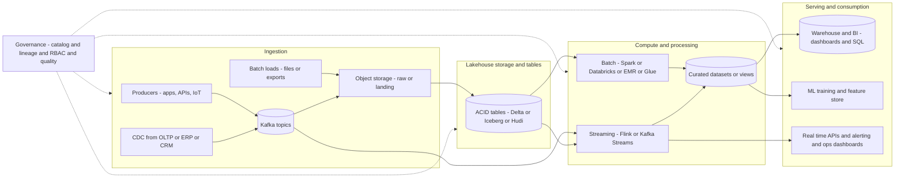
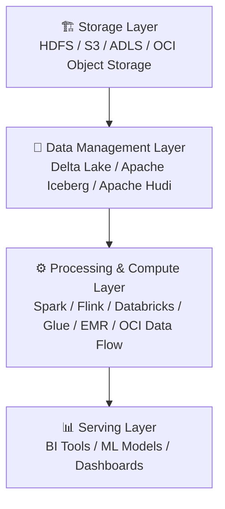
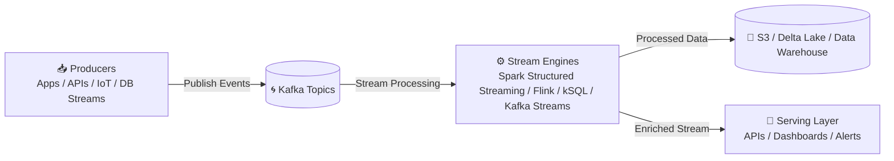
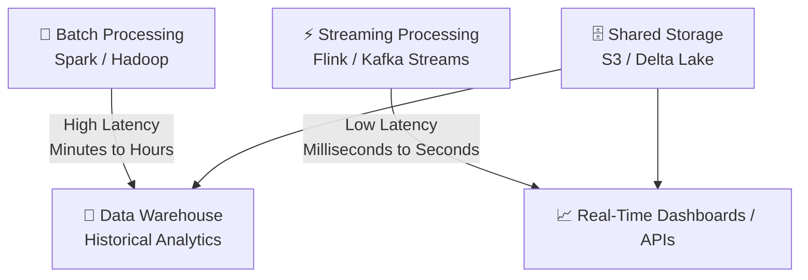
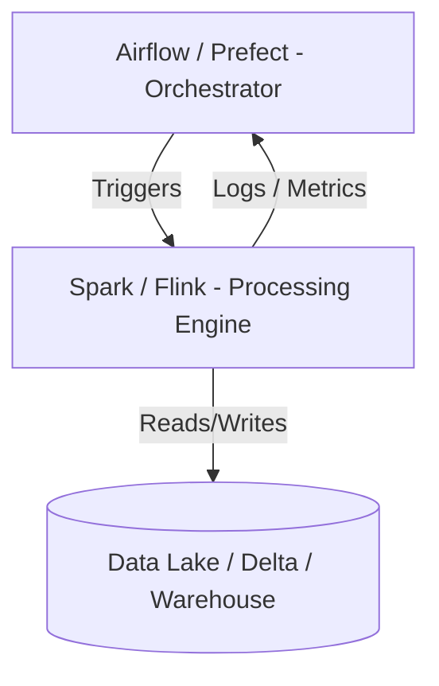

---------------------------------------------------------------
MODERN DATA PLATFORM (END-TO-END): INGESTION → LAKEHOUSE → SERVING

---------------------------------------------------------------

---------------------------------------------------------------
DATA STORAGE + PROCESSING LAYERS
---------------------------------------------------------------

-------------------------------------------------------------------
STREAMING DATA FLOW
-------------------------------------------------------------------

-------------------------------------------------------------------
 BATCH VS STREAMING TRADE-OFFS
-------------------------------------------------------------------

