```mermaid

graph TD
    %% Raw storage layer
    A[🏗️ Storage Layer<br/>HDFS / S3 / ADLS / OCI Object Storage]
    %% Unified transactional layer
    A --> B[🧩 Data Management Layer<br/>Delta Lake / Apache Iceberg / Apache Hudi]
    %% Processing engines
    B --> C[⚙️ Processing & Compute Layer<br/>Spark / Flink / Databricks / Glue / EMR / OCI Data Flow]
    %% Serving and analytics
    C --> D[📊 Serving Layer<br/>BI Tools / ML Models / Dashboards]

    %% Comments
    %% A = where raw data lands (cheap, scalable storage)
    %% B = adds ACID, schema, and versioning to make lakes reliable
    %% C = transforms, aggregates, and enriches data
    %% D = delivers insights to business or ML systems

```

```mermaid

graph LR
    %% Producers (event sources)
    A[📥 Producers<br/>Apps / APIs / IoT / DB Streams]
    %% Kafka as central event hub
    A -->|Publish Events| B[(🌀 Kafka Topics)]
    %% Stream processors
    B -->|Stream Processing| C[⚙️ Stream Engines<br/>Spark Structured Streaming / Flink / kSQL / Kafka Streams]
    %% Persistent sink
    C -->|Processed Data| D[(💾 S3 / Delta Lake / Data Warehouse)]
    %% Real-time consumers
    C -->|Enriched Stream| E[📡 Serving Layer<br/>APIs / Dashboards / Alerts]

    %% Comments
    %% A = producers push data continuously
    %% B = Kafka buffers, partitions, and stores messages durably
    %% C = stream processors consume and enrich in-flight data
    %% D = long-term sinks for analytics or history
    %% E = low-latency consumers for real-time insights


```

```mermaid

graph TD
    %% Batch path
    A[🧮 Batch Processing<br/>Spark / Hadoop] -->|High Latency<br/>Minutes to Hours| B[🏢 Data Warehouse<br/>Historical Analytics]
    %% Streaming path
    C[⚡ Streaming Processing<br/>Flink / Kafka Streams] -->|Low Latency<br/>Milliseconds to Seconds| D[📈 Real-Time Dashboards / APIs]
    %% Shared storage foundation
    E[🗄️ Shared Storage<br/>S3 / Delta Lake] --> B
    E --> D

    %% Comments
    %% Batch = periodic, throughput-focused, used for deep analytics
    %% Streaming = continuous, latency-focused, used for instant insights
    %% Both converge on same storage foundation (Lakehouse)

```

---------------------------------------------------------------
MODERN DATA PLATFORM (END-TO-END): INGESTION → LAKEHOUSE → SERVING

---------------------------------------------------------------

---------------------------------------------------------------
DATA STORAGE + PROCESSING LAYERS
---------------------------------------------------------------

-------------------------------------------------------------------
STREAMING DATA FLOW
-------------------------------------------------------------------

-------------------------------------------------------------------
 BATCH VS STREAMING TRADE-OFFS
-------------------------------------------------------------------

