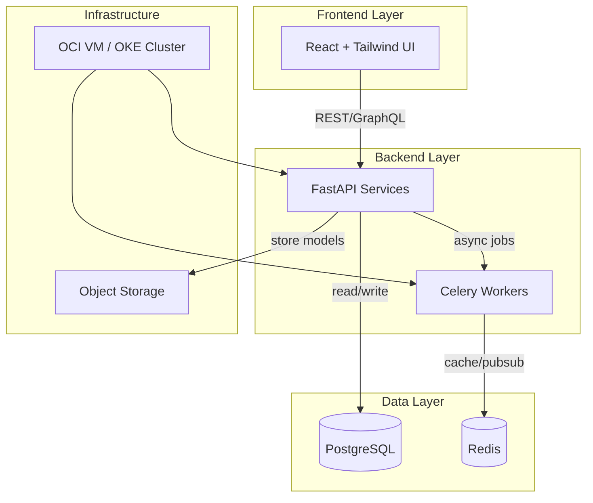

```mermaid
graph TD
  subgraph UI[Frontend Layer]
    A[React + Tailwind UI]
  end

  subgraph API[Backend Layer]
    B[FastAPI Services]
    C[Celery Workers]
  end

  subgraph DATA[Data Layer]
    D[(PostgreSQL)]
    E[(Redis)]
  end

  subgraph CLOUD[Infrastructure]
    F[OCI VM / OKE Cluster]
    G[Object Storage]
  end

  A -->|REST/GraphQL| B
  B -->|async jobs| C
  B -->|read/write| D
  C -->|cache/pubsub| E
  B -->|store models| G
  F --> B
  F --> C


```
